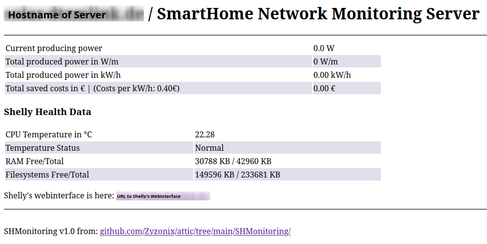

# SHMonitoring ShellyPlug Monitoring

This script hosts a simple webserver that periodically pulls data from a Shelly PowerMeter Plug and displays this data.

The webpage later is hosted on port 80 and will look like this:



## Installation

This script was developed to be run on a Linux container, the following commands are prepared for ```systemd``-based distributions. 

The installation process is quite easy:

 - Create directories:
```
mkdir -p /root/SHMonitoring
```
```
mkdir -p /var/log/SHMonitoring
```
 - Download ```server.py``` and ```SHMonitoring.service``` 
 - Move the service file to the correct directory
```
mv /root/SHMonitoring/SHMonitoring.service /etc/systemd/system
```  
 - Edit ```server.py```: Set ```SERVERIP``` to the IP on which the webbserver should bind on and ```SHELLYURL``` to the URL of the ShellyPlug that should be monitored.
 - Install required Python packages: ```uvicorn``` and ```fastapi``` (either as ```python3-uvicorn``` and ```python3-fastapi``` or via ```pip3 install fastapi uvicorn```)
 - Enable and start the server
```
systemctl enable SHMonitoring.service
```
```
systemctl start SHMonitoring.service
```  
 - Check the current output with
```
journalctl -r -u SHMonitoring.service
``` 
